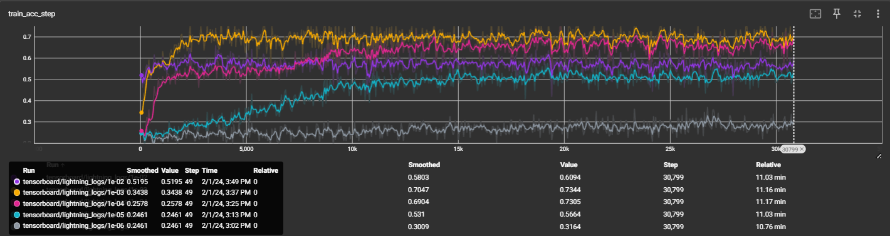
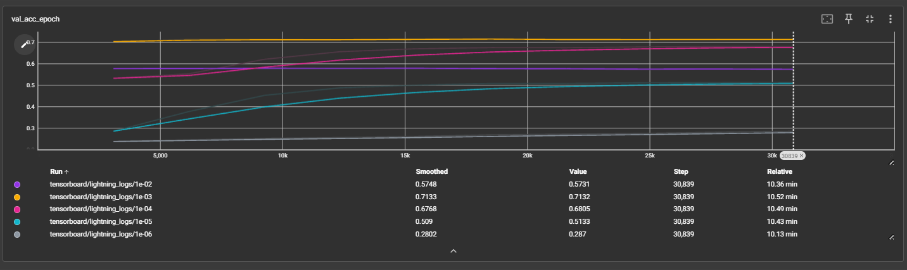
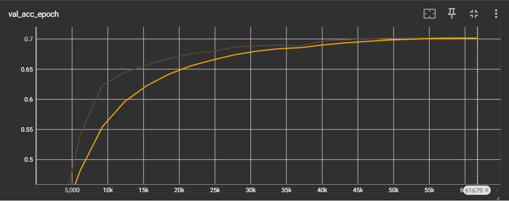

# Lab 1

### 1) What is the impact of batch sizes and why?
 
Batch sizes influenced computational efficiency, model accuracy, and convergence of the model. By altering the batch size from the original command, while keeping the default learning rate of 1e-05 and max epochs constant, we observed significant variations in the duration of an epoch across different batch sizes on a laptop equipped with an Nvidia GTX 1650Ti GPU:

Batch Size: Training time
- 64: 4.8min
- 128: 2.6min
- 256: 1.3min
- 512: 39.66s
- 1024: 19.17s
- 2048: 12.58s


These results demonstrate that increasing the batch size leads to a reduction in the time required for each training epoch. This is primarily because larger batch sizes allow for more effective utilization of the parallel processing capabilities of the GPU.


However, this increase in computational efficiency comes at a cost. The validation accuracy tends to decrease with larger batch sizes. This phenomenon indicates a trade-off when choosing batch sizes: while larger batches can accelerate training, they may also hinder the model's ability to generalize effectively to unseen data. This can be attributed to the fact that larger batch sizes provide a more accurate estimate of the gradient, but this can lead to local minima in the loss landscape, which are often associated with poorer generalization.


Moreover, smaller batch sizes offer the advantage of more frequent updates to the model weights, which can help in escaping local minima and potentially finding better generalizing minima. However, too small a batch size might result in a noisy gradient estimate, leading to unstable training and possibly requiring a lower learning rate to maintain stability.

### 2) What is the impact of varying the maximum epoch number?
Increasing the maximum epoch number result in a longer total training time. With longer training, the training accuracy improves until or stays the same. The validation accuracy also improves on a first stage. However, past a a high enough epoch number (higher than 25 for the jsc-tiny network with the default learning rate and a batch size of 256), the validation accuracy starts to decline again: This is sign that the network is overfitting.


### 3) What is happening with a large learning and what is happening with a small learning rate and why? What is the relationship between learning rates and batch sizes?
As seen in the figure below, with a large learning rate of 1e-02 (purple), the network improves both train and validation accuracy drastically to around 55% training/validation accuracy during the first epoch, initially better than the default learning rate. However, the network the default learning rate of 1e-03 quickly surpases the large learning rate off 1e-02 by the end of the first epoch. By the end of the 10 epochs, the 1e-02 learning rate achieved 55% train accuracy compared to the 70% achieved by lr=1e-03 (yellow). This is because a large learning rate does not allow the network to converge to a better minimum loss. 

A small learning rate makes the accuracy of the network improve very slowly over time. In our case with a small learning rate of 1e-06 (grey), the train/val accuracies by the end of epoch 1 was 15%. By the end of the 10 epochs the train/val accuracies were around 30% (with 10 max epochs). A slow learning rate restricts the the backpropagated loss, and prevents the network from learning.


Training Accuracy:




Validation Accuracy:




Batchsizes and learning rate are interconnected in how the influence the model's training. Larger batch sizes have a smoother gradient and thus can use a slightly higher learning rate. Conversely, smaller batch sizes are more noisy, thus requiring a smaller learning rate to manage that instability.

### 4) Implement a network that has in total around 10x more parameters than the toy network.
The toy network was assumed to be jsc-tiny network with 117 parameters. The implemented JSC-big network has 1.4k parameters:
```python
class JSC_Big(nn.Module):
    def __init__(self, info):
        super(JSC_Big, self).__init__()
        self.seq_blocks = nn.Sequential(
            # 1st LogicNets Layer
            nn.BatchNorm1d(16),  # input_quant       # 0
            nn.ReLU(16),  # 1
            nn.Linear(16, 32),  # linear              # 2

            # 2nd LogicNets Layer
            nn.BatchNorm1d(32),  # output_quant       # 3
            nn.ReLU(32), # 4
            nn.Linear(32, 16),  # linear              # 5

            # 3th LogicNets Layer
            nn.BatchNorm1d(16),  # output_quant       # 6
            nn.ReLU(16),  # 7
            nn.Linear(16, 8),  # linear              # 8

            # 4th LogicNets Layer
            nn.BatchNorm1d(8),  # output_quant       # 9
            nn.ReLU(8),  # 10
            nn.Linear(8, 5),  # linear              # 11

            nn.ReLU(5),  # 12
        )

    def forward(self, x):
        return self.seq_blocks(x)
```


### 5) Test your implementation and evaluate its performance.
For this experiment, we will set the batch size to 256 (as it shown to be a good balance of speed and performance), and allow maximum epoch number of 20.

The Big-JSC network attained a validation accuracy of 0.703 (shown below), very similar to the validaiton accuracy of the tiny-jsc network with a learning rate of 1e-03 (which was also 0.7). However, if we compare the two networs with the exxatc same training setting (default learning rate of 1e-05 and a batchsize of 256), the Big-JSC network performs better, reaching the plateau accuracy of 0.70 much faster than the smaller tiny-jsc.



These observations shows that a higher complexity network will not always lead to better performance, specially when the training hyperparameters are not adjusted. It should be also noted that a larger network also increases the risk of overfitting. However, in this case the 20 epoch training, was not enough to cause overfitting as the validation accuracy did not drop during training.


# Lab 2

### 1) Explain the functionality of report_graph_analysis_pass and its printed jargons such as placeholder, get_attr ... You might find the doc of torch.fx useful.

report_graph_analysis_app is designed to analyze and generate a report on the structure of the model.

placeholder: the placeholder node represents an input to the model's graph. The output shows %x is a placeholder for the input tensor to the model.

get_attr: This operation is used when the graph needs to fetch an attribute from the model, such as a weight or a bias directly accessed in the forward pass. If the model's forward pass does not explicitly access attributes outside of its modules or if those accesses are encapsulated within the modules themselves (as is common with layers defined in nn.Sequential), then get_attr operations will have a count of zero.

call_function: This represents direct calls to standalone functions in the graph, such as functional API calls (torch.nn.functional). Since the JSC_Tiny model uses layers from torch.nn (e.g., nn.BatchNorm1d, nn.ReLU, nn.Linear) which are encapsulated as module calls rather than raw functional calls in its forward pass, there are no call_function nodes generated in its graph.

call_method: This refers to method calls on objects within the graph, which could include tensor operations like tensor.squeeze() or tensor.view(). 

call_module: This type of node represents a call to a module within the nn.Sequential container in the PyTorch model. Each call_module operation in the output corresponds to one of the layers in the JSC_Tiny class's seq_blocks. The arguments (args and kwargs) to these calls are the inputs to each module.

output: This node represents the output of the graph. In the example, seq_blocks_3 is the final output of the model's graph, indicating the result of the computation pipeline defined by JSC_Tiny.


### 2) What are the functionalities of profile_statistics_analysis_pass and report_node_meta_param_analysis_pass respectively?

Overall, the purpose of these analysis passes is to analyze and report various statistics and metadata about the nodes within the graph.

##### profile_statistics_analysis_pass:
This pass performs statistical analysis on the graph by profiling different aspects of the nodes, such as weights and activations.

Registering Stat Collections: It registers the need to collect statistics based on the criteria specified in pass_args. This can include profiling by node type, targeting specific nodes for weight or activation statistics, and deciding whether to profile output activations.

Profiling Weights: It profiles the weights of the nodes, gathering statistics like variance. This is useful for understanding the distribution of weights across the model.

Profiling Activations: It profiles activation outputs, which can help in understanding the behavior of the model in response to its inputs, such as detecting dead neurons.

Input Sampling: The pass uses an input generator to feed data into the model, allowing for dynamic analysis based on actual model inputs.

##### report_node_meta_param_analysis_pass:

This pass performs a meta-parameter analysis on the nodes in the graph, generating a detailed report that includes:

Node Identification: Each node is identified by its name and the operation it performs (Fx Node op), such as a placeholder for inputs, a call to a module, or the output operation.

Classification by Type: Nodes are classified by their Mase type and the specific Mase op they perform within that type.

Parameter Analysis: The pass analyzes parameters associated with each node, which can be categorized into common, hardware, and software parameters.

Report Generation: The analysis results in a detailed report, formatted as a table that lists each node along with its parameters and statistics.

### 3) Explain why only 1 OP is changed after the quantize_transform_pass
The reason why only 1 OP is changed is related to the pass_args provided. The pass_args specify that only the "linear" layer are targeted for quantization. As there is only one linear layer in JSC_tiny, only one OP was changed.


### 4) Write some code to traverse both mg and ori_mg, check and comment on the nodes in these two graphs. You might find the source code for the implementation of summarize_quantization_analysis_pass useful.

Here is the code to traverse and compare the nodes of ori_mg and mg:

```python
from chop.passes.graph.transforms.quantize.summary import graph_iterator_compare_nodes
from chop.passes.graph.utils import get_mase_op, get_mase_type, get_node_actual_target
import pandas as pd

import pandas as pd
from chop.passes.graph.utils import get_mase_op, get_mase_type, get_node_actual_target

def extract_node_type(node):
    target = get_node_actual_target(node)
    if node.op == "call_module" or get_mase_type(node) in ["builtin_func", "module_related_func", "patched_func", "implicit_func"]:
        return target.__name__ if hasattr(target, '__name__') else str(target)
    return node.target

def compare_graph_nodes(original_graph, quantized_graph):
    data = {
        "Node Name": [],
        "Operation Type": [],
        "Operation": [],
        "Type Before": [],
        "Type After": [],
        "Is Changed": [],
    }
    
    for ori_node, quant_node in zip(original_graph.fx_graph.nodes, quantized_graph.fx_graph.nodes):
        ori_type = extract_node_type(ori_node)
        quant_type = extract_node_type(quant_node)
        data["Node Name"].append(quant_node.name)
        data["Operation Type"].append(get_mase_type(quant_node))
        data["Operation"].append(get_mase_op(quant_node))
        data["Type Before"].append(ori_type)
        data["Type After"].append(quant_type)
        data["Is Changed"].append(ori_type != quant_type)
        
    summary_df = pd.DataFrame(data)
    print(f"Quantization Summary:\n{summary_df.to_markdown(index=False)}")
```
The output for ori_mg and mg is shown below:

Quantization Summary:
| Node Name    | Operation Type      | Operation    | Type Before                                                                     | Type After                                                                      | Is Changed   |
|:-------------|:--------------------|:-------------|:--------------------------------------------------------------------------------|:--------------------------------------------------------------------------------|:-------------|
| x            | placeholder         | placeholder  | x                                                                               | x                                                                               | False        |
| seq_blocks_0 | module              | batch_norm1d | BatchNorm1d(16, eps=1e-05, momentum=0.1, affine=True, track_running_stats=True) | BatchNorm1d(16, eps=1e-05, momentum=0.1, affine=True, track_running_stats=True) | False        |
| seq_blocks_1 | module_related_func | relu         | ReLU(inplace=True)                                                              | ReLU(inplace=True)                                                              | False        |
| seq_blocks_2 | module_related_func | linear       | Linear(in_features=16, out_features=5, bias=True)                               | LinearInteger(in_features=16, out_features=5, bias=True)                        | True         |
| seq_blocks_3 | module_related_func | relu         | ReLU(inplace=True)                                                              | ReLU(inplace=True)                                                              | False        |
| output       | output              | output       | output                                                                          | output                                                                          | False        |

The table shows that the only change was in the quantized linear layer, where the new type is now LinearInteger. This is as expected according to the previous results.


### 5) Perform the same quantisation flow to the bigger JSC network that you have trained in lab1. You must be aware that now the pass_args for your custom network might be different if you have used more than the Linear layer in your network.

JSC_Big was successfully quantized using the same structure and arguments as before. The JSC_Big network did not use any extra new layers that were not used by the JSC_Tiny network, therefore there was no issue with the arguments:

Quantization Summary:
| Node Name     | Operation Type      | Operation    | Type Before                                                                     | Type After                                                                      | Is Changed   |
|:--------------|:--------------------|:-------------|:--------------------------------------------------------------------------------|:--------------------------------------------------------------------------------|:-------------|
| x             | placeholder         | placeholder  | x                                                                               | x                                                                               | False        |
| seq_blocks_0  | module              | batch_norm1d | BatchNorm1d(16, eps=1e-05, momentum=0.1, affine=True, track_running_stats=True) | BatchNorm1d(16, eps=1e-05, momentum=0.1, affine=True, track_running_stats=True) | False        |
| seq_blocks_1  | module_related_func | relu         | ReLU(inplace=True)                                                              | ReLU(inplace=True)                                                              | False        |
| seq_blocks_2  | module_related_func | linear       | Linear(in_features=16, out_features=16, bias=True)                              | LinearInteger(in_features=16, out_features=16, bias=True)                       | True         |
| seq_blocks_3  | module              | batch_norm1d | BatchNorm1d(16, eps=1e-05, momentum=0.1, affine=True, track_running_stats=True) | BatchNorm1d(16, eps=1e-05, momentum=0.1, affine=True, track_running_stats=True) | False        |
| seq_blocks_4  | module_related_func | relu         | ReLU(inplace=True)                                                              | ReLU(inplace=True)                                                              | False        |
| seq_blocks_5  | module_related_func | linear       | Linear(in_features=16, out_features=16, bias=True)                              | LinearInteger(in_features=16, out_features=16, bias=True)                       | True         |
| seq_blocks_6  | module              | batch_norm1d | BatchNorm1d(16, eps=1e-05, momentum=0.1, affine=True, track_running_stats=True) | BatchNorm1d(16, eps=1e-05, momentum=0.1, affine=True, track_running_stats=True) | False        |
| seq_blocks_7  | module_related_func | relu         | ReLU(inplace=True)                                                              | ReLU(inplace=True)                                                              | False        |
| seq_blocks_8  | module_related_func | linear       | Linear(in_features=16, out_features=16, bias=True)                              | LinearInteger(in_features=16, out_features=16, bias=True)                       | True         |
| seq_blocks_9  | module              | batch_norm1d | BatchNorm1d(16, eps=1e-05, momentum=0.1, affine=True, track_running_stats=True) | BatchNorm1d(16, eps=1e-05, momentum=0.1, affine=True, track_running_stats=True) | False        |
| seq_blocks_10 | module_related_func | relu         | ReLU(inplace=True)                                                              | ReLU(inplace=True)                                                              | False        |
| seq_blocks_11 | module_related_func | linear       | Linear(in_features=16, out_features=16, bias=True)                              | LinearInteger(in_features=16, out_features=16, bias=True)                       | True         |
| seq_blocks_12 | module              | batch_norm1d | BatchNorm1d(16, eps=1e-05, momentum=0.1, affine=True, track_running_stats=True) | BatchNorm1d(16, eps=1e-05, momentum=0.1, affine=True, track_running_stats=True) | False        |
| seq_blocks_13 | module_related_func | relu         | ReLU(inplace=True)                                                              | ReLU(inplace=True)                                                              | False        |
| seq_blocks_14 | module_related_func | linear       | Linear(in_features=16, out_features=5, bias=True)                               | LinearInteger(in_features=16, out_features=5, bias=True)                        | True         |
| seq_blocks_15 | module_related_func | relu         | ReLU(inplace=True)                                                              | ReLU(inplace=True)                                                              | False        |
| output        | output              | output       | output                                                                          | output                                                                          | False        |

### 6) Write code to show and verify that the weights of these layers are indeed quantised. You might need to go through the source code of the implementation of the quantisation pass and also the implementation of the Quantized Layers .

It can be directly seen using the code for the network traversions presented in the previous question that the Linear layers of the network were indeed quantized:

Quantization Summary:
| Node Name     | Operation Type      | Operation    | Type Before                                                                     | Type After                                                                      | Is Changed   |
|:--------------|:--------------------|:-------------|:--------------------------------------------------------------------------------|:--------------------------------------------------------------------------------|:-------------|
| x             | placeholder         | placeholder  | x                                                                               | x                                                                               | False        |
| seq_blocks_0  | module              | batch_norm1d | BatchNorm1d(16, eps=1e-05, momentum=0.1, affine=True, track_running_stats=True) | BatchNorm1d(16, eps=1e-05, momentum=0.1, affine=True, track_running_stats=True) | False        |
| seq_blocks_1  | module_related_func | relu         | ReLU(inplace=True)                                                              | ReLU(inplace=True)                                                              | False        |
| seq_blocks_2  | module_related_func | linear       | Linear(in_features=16, out_features=16, bias=True)                              | LinearInteger(in_features=16, out_features=16, bias=True)                       | True         |
| seq_blocks_3  | module              | batch_norm1d | BatchNorm1d(16, eps=1e-05, momentum=0.1, affine=True, track_running_stats=True) | BatchNorm1d(16, eps=1e-05, momentum=0.1, affine=True, track_running_stats=True) | False        |
| seq_blocks_4  | module_related_func | relu         | ReLU(inplace=True)                                                              | ReLU(inplace=True)                                                              | False        |
| seq_blocks_5  | module_related_func | linear       | Linear(in_features=16, out_features=16, bias=True)                              | LinearInteger(in_features=16, out_features=16, bias=True)                       | True         |
| seq_blocks_6  | module              | batch_norm1d | BatchNorm1d(16, eps=1e-05, momentum=0.1, affine=True, track_running_stats=True) | BatchNorm1d(16, eps=1e-05, momentum=0.1, affine=True, track_running_stats=True) | False        |
| seq_blocks_7  | module_related_func | relu         | ReLU(inplace=True)                                                              | ReLU(inplace=True)                                                              | False        |
| seq_blocks_8  | module_related_func | linear       | Linear(in_features=16, out_features=16, bias=True)                              | LinearInteger(in_features=16, out_features=16, bias=True)                       | True         |
| seq_blocks_9  | module              | batch_norm1d | BatchNorm1d(16, eps=1e-05, momentum=0.1, affine=True, track_running_stats=True) | BatchNorm1d(16, eps=1e-05, momentum=0.1, affine=True, track_running_stats=True) | False        |
| seq_blocks_10 | module_related_func | relu         | ReLU(inplace=True)                                                              | ReLU(inplace=True)                                                              | False        |
| seq_blocks_11 | module_related_func | linear       | Linear(in_features=16, out_features=16, bias=True)                              | LinearInteger(in_features=16, out_features=16, bias=True)                       | True         |
| seq_blocks_12 | module              | batch_norm1d | BatchNorm1d(16, eps=1e-05, momentum=0.1, affine=True, track_running_stats=True) | BatchNorm1d(16, eps=1e-05, momentum=0.1, affine=True, track_running_stats=True) | False        |
| seq_blocks_13 | module_related_func | relu         | ReLU(inplace=True)                                                              | ReLU(inplace=True)                                                              | False        |
| seq_blocks_14 | module_related_func | linear       | Linear(in_features=16, out_features=5, bias=True)                               | LinearInteger(in_features=16, out_features=5, bias=True)                        | True         |
| seq_blocks_15 | module_related_func | relu         | ReLU(inplace=True)                                                              | ReLU(inplace=True)                                                              | False        |
| output        | output              | output       | output                                                                          | output                                                                          | False        |


As shown in the table, the linear layers are now all type LinearInteger layers, indicating that quanztization was successful. 

To verify this further, we can print out the weights of the layers. We notice that the Linear integer layer quantizes the weights on the go with w_quantizer(), thus:
```python
# original linear layer in the MaseGraph
linear_layer = getattr(ori_mg.modules["seq_blocks"], "2") # '2' for the linear layer
print(linear_layer.weight)

# the LinearInteger node quantizes the weights using w_quantizer()
linear_base = getattr(mg.modules["seq_blocks"], "2")
print(linear_base.w_quantizer(linear_layer.weight))
```

And immediately we see the effects of the quantization:
Non-quantized:
tensor([[-0.0499,  0.1747, -0.1870, -0.2675, -0.0879,  0.0377, -0.0110,  0.1829,
         -0.0284,  0.0761, -0.0454, -0.0480, -0.2203, -0.1535, -0.0778, -0.0026],
        [-0.0109,  0.1496, -0.1858, -0.0921,  0.0454,  0.1619, -0.0464,  0.1796,
         -0.0355,  0.0961,  0.3038, -0.1623, -0.0734, -0.0141, -0.0834,  0.2813],
        [-0.1425, -0.1465, -0.2504, -0.3557, -0.1971,  0.1508,  0.0760,  0.0780,
...


Quantized: 

tensor([[-0.0000,  0.2500, -0.2500, -0.2500, -0.0000,  0.0000, -0.0000,  0.2500,
         -0.0000,  0.0000, -0.0000, -0.0000, -0.2500, -0.2500, -0.0000, -0.0000],
        [-0.0000,  0.2500, -0.2500, -0.0000,  0.0000,  0.2500, -0.0000,  0.2500,
         -0.0000,  0.0000,  0.2500, -0.2500, -0.0000, -0.0000, -0.0000,  0.2500],
        [-0.2500, -0.2500, -0.2500, -0.2500, -0.2500,  0.2500,  0.0000,  0.0000,
...


### 7) Load your own pre-trained JSC network, and perform perform the quantisation using the command line interface.

By creating a new toml file, with model = "jsc-big" and the checkpoint set to pre-trained big-jsc network, we can directly run from the terminal:

"./ch transform --config configs/examples/jsc_big_by_type.toml --task cls --cpu=0"

Which performs the transform:

INFO     Initialising model 'jsc-big'...
INFO     Initialising dataset 'jsc'...
INFO     Project will be created at /home/mp1820/mase/mase_output/jsc-tiny
INFO     Transforming model 'jsc-big'...
INFO     Quantized graph histogram:
INFO     
| Original type   | OP           |   Total |   Changed |   Unchanged |
|-----------------+--------------+---------+-----------+-------------|
| BatchNorm1d     | batch_norm1d |       4 |         0 |           4 |
| Linear          | linear       |       4 |         4 |           0 |
| ReLU            | relu         |       5 |         0 |           5 |
| output          | output       |       1 |         0 |           1 |
| x               | placeholder  |       1 |         0 |           1 |
INFO     Saved mase graph to /home/mp1820/mase/mase_output/jsc-tiny/software/transform/transformed_ckpt
INFO     Transformation is completed